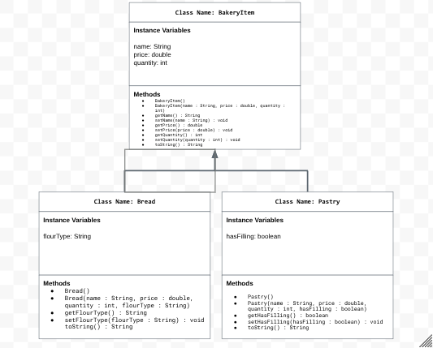

# Unit 2 - Store Management Project

## Introduction

You are opening a new business in your community! Businesses often need programs to manage the products and services they offer and track orders and requests from customers. Your goal is to create a store management system for your business.

## Requirements

Use your knowledge of object-oriented programming and class structure and design to create your store management system:
- **Create a class hierarchy** – Develop a superclass that represents a product or service your business offers and one or more subclasses that extend the superclass to represent more specific types of products or services.
- **Declare instance variables** – Declare instance variables in the superclass that are shared with the subclasses and instance variables in the subclasses that are not shared with the superclass.
- **Write constructors** – Write no-argument and parameterized constructors in the superclass and subclasses. Subclass constructors use the super keyword to call the superclass constructor.
- **Implement accessor and mutator methods** – Write accessor and mutator methods for instance variables that should be accessible and/or modifiable from outside of the class.
- **Implement a toString() method** – Write toString() methods in the superclass and subclasses that return information about the state of an object.

## UML Diagram

## Description

I created a Bakery Store Management System to demonstrate Java inheritance. The superclass, BakeryItem, stores common info like name, price, and quantity, while subclasses Bread, Pastry, and Muffin add unique features. Using constructors, getters/setters, and toString(), the program models real bakery items. With user input, it could create and display item details.

---

### **Project Description**

For my project, I created a Bakery Store Management System that manages different baked goods like bread, pastries, and muffins. I chose this topic because it clearly shows how inheritance and class hierarchy work in Java.

The main class, BakeryItem, is the superclass that holds shared information such as the name, price, and quantity. The subclasses — Bread, Pastry, and Muffin — each extend the superclass and add unique features like flour type, filling, and flavor. I used constructors, getters and setters, and the toString() method to display item details.

If user input were added, the user could enter information about the product, and the program would create an object and print its details to the console. This project uses encapsulation, inheritance, and abstraction to model real bakery items.

---

